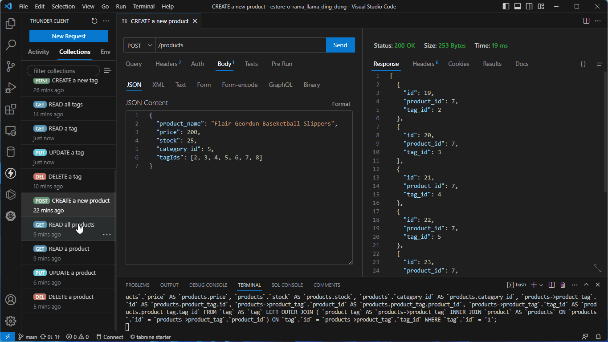

# Module 13 Challenge | Object-Relational Mapping (ORM): E-Commerce Back End


## Description

The challenge is to build functional routes for the existing e-commerce back end system using Express.js and Sequelize tointeract with a MySQL database.

## Table of Contents

- [Installation](#installation)
- [Usage](#usage)
- [Sample](#sample)
- [Contributing](#contributing)
- [Questions](#questions)
- [Credits](#credits)

## Installation

To install this application, perform the following:

Clone the repository, enter the newly cloned application directory, and run the following command.
```js
npm install
```

## Usage

To run this application, enter the following command in your terminal and then hit the "Enter" key.
```js
node index.js
```
## Sample



## Contributing

Feel free to fork this repository and create a Pull Request.

## Questions

If you have any questions, please feel free to reach out to me via [email](mailto:jo_nez@hotmail.com) or on [Github](https://github.com/MyComplex/).

## Credits

This project contains portions of code supplied by the edX bootcamp curriculum as "Starter Code", as well as various boiler-plate snippets from the utilized modules' documentation. All rights are reserved by the respective entities.
